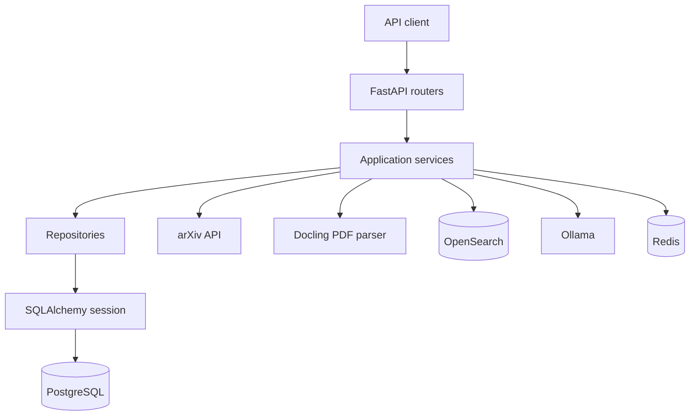
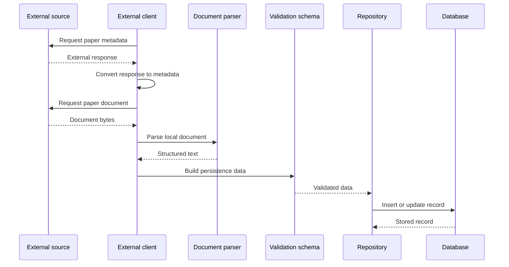
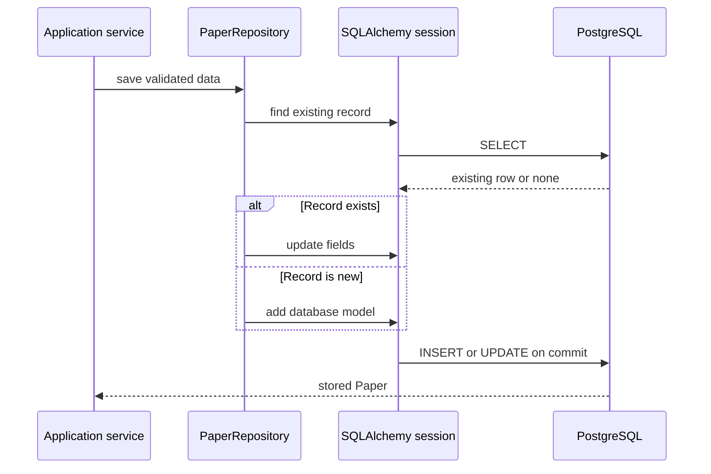
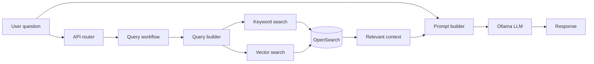

# Practice RAG Production

My own build-along of the **arXiv Paper Curator** course
(`production-agentic-rag-course`), written as plain Python instead of
Jupyter notebooks. Same architecture, same week-by-week progression — but
every file here is a skeleton I fill in myself so I actually learn it,
instead of running someone else's notebook cells.

## How this is organized

- **`docs/`** — one guide per week (`week1.md` ... `week7.md`). This is
  where the actual teaching lives: what the concept is and why it works
  the way it does, then a file-by-file walkthrough of the approach for
  everything you'll implement that week. Read the guide *before* opening
  any code — the TODO comments in `src/` are short reminders, not the
  explanation.
- **`src/`** — the actual application, laid out the same way a real
  production RAG service would be (routers / services / repositories /
  models), growing by one or two modules each week. Every file starts
  as a stub: docstring explaining *what* it's for and *why*, function/class
  signatures already typed out, and `# TODO` comments instead of a
  finished body.
- **`scripts/`** — one plain script per week (`week1_verify_infra.py`,
  `week2_test_arxiv_pipeline.py`, ...). These replace the course's
  Jupyter notebooks: same step-by-step flow, printed section by section,
  no helper framework of their own — every line is visible top to bottom,
  the same way a notebook reads cell by cell. Each script calls straight
  into the `src/` modules for that week, so it will raise
  `NotImplementedError` — with a traceback pointing at the exact file and
  line — until I've actually written the code. That's the point: it's my
  checklist, not something to debug.
- **`ROADMAP.md`** — the week-by-week index: which guide to read, which
  files to implement, which script proves it works.

## Setup

```bash
uv sync
cp .env.example .env
docker compose up -d
```

That last command starts this project's own local infra — Postgres,
OpenSearch, Ollama, Redis, and Airflow, all in `compose.yml` right here
— so you never need to `cd` into the course repo for everyday work.
`.env` already points at `localhost` with matching ports. Airflow is
built from a local copy of the course's own `airflow/Dockerfile` (in
`./airflow`), so the first `docker compose up -d` takes a few extra
minutes while it builds. Langfuse (Week 6, optional) is the one thing
still left in the course repo — it's a 6-container stack of its own;
`compose.yml`'s comments explain why and what to do instead.

## Working through it

1. Open [ROADMAP.md](ROADMAP.md) and pick the next unchecked week.
2. Read that week's guide in `docs/` — the concept, then the plan for
   every file you're about to touch.
3. Implement the `# TODO`s in the files it lists.
4. Run that week's script in `scripts/`. When it runs to the end without
   a `NotImplementedError` traceback, move on.
5. If you get properly stuck on a specific function, the course's own
   `README.md`/notebook for that week (linked at the bottom of each
   guide) has more context, and the finished reference implementation is
   sitting right next to this repo at
   `../production-agentic-rag-course/src/...` — try for real first, then
   peek only at the one function you're stuck on.

## Layout

```
compose.yml                  # local infra: Postgres/OpenSearch/Ollama/Redis/Airflow
airflow/                     # Airflow's Dockerfile + entrypoint, copied from the course repo
docs/                        # week1.md ... week7.md — read these first
src/
├── config.py                 # Week 1 — settings from .env
├── main.py                   # Week 1 — FastAPI app, wires up routers
├── db/session.py              # Week 2 — SQLAlchemy engine/session
├── models/paper.py             # Week 2 — Paper ORM model
├── repositories/paper.py       # Week 2 — Paper CRUD / upsert
├── schemas/                  # Pydantic request/response/data models
├── services/
│   ├── arxiv/client.py         # Week 2 — rate-limited arXiv API client
│   ├── pdf_parser/parser.py    # Week 2 — Docling PDF parsing
│   ├── metadata_fetcher.py     # Week 2 — orchestrates the ingestion pipeline
│   ├── opensearch/            # Week 3 — index config, query builder, client
│   ├── indexing/               # Week 4 — chunking + indexing pipeline
│   ├── embeddings/jina_client.py  # Week 4 — Jina embeddings client
│   ├── ollama/                # Week 5 — local LLM client + prompts
│   ├── cache/redis_cache.py    # Week 6 — response caching
│   ├── langfuse_tracer.py      # Week 6 — pipeline tracing
│   ├── agents/                # Week 7 — LangGraph agentic RAG
│   └── telegram_bot.py         # Week 7 — Telegram bot integration
└── routers/                  # FastAPI endpoints, one set per week
scripts/                     # Week 1-7 runnable scripts (the notebook replacement)
```

## System Design

Standalone diagrams:

- [System Architecture](docs/system-architecture.md)
- [Data Ingestion Design](docs/week2-ingestion-flow.md)
- [RAG Query Design](docs/rag-query-flow.md)

The system can be understood from several complementary design angles.

### Layered Architecture



- **Routers** receive HTTP requests and return validated responses.
- **Services** coordinate workflows across external systems and storage.
- **Repositories** contain database queries and persistence logic.
- **Models** describe database tables; **schemas** describe validated data
  entering or leaving the application.
- **Clients** isolate communication with arXiv, OpenSearch, Ollama, and
  other external services.

### Data Flow View

The ingestion path moves information from external sources into durable
application data:

```mermaid
flowchart LR
  Runner[Application workflow] --> Fetcher[Workflow orchestrator]
  Fetcher --> ArxivClient[ArxivClient]
  ArxivClient --> ExternalAPI[External content API]
  ExternalAPI --> Metadata[Validated metadata]

  Metadata --> Download[Download PDF]
  Download --> Cache[(PDF cache)]
  Cache --> Parser[Document parser]
  Parser --> Parsed[Structured document]

  Metadata --> Create[PaperCreate]
  Parsed --> Create
  Create --> Repository[PaperRepository]
  Repository --> Database[(Database)]
```



The data changes shape as it moves through the system:

```text
external response
  -> validated metadata
  -> local document
  -> parsed document
  -> persistence schema
  -> database row
```

The orchestrator coordinates the workflow, while each client, parser, and
repository owns one type of work. A failure in one item should be isolated
when the workflow processes a batch.

### One Paper's Lifecycle



The lifecycle shows the movement of one item. The layered view shows who
owns each responsibility; this view shows the order in which the work
happens.

### Persistence Boundary



The session owns the transaction boundary. The repository owns the query,
and the service decides when the operation should happen.

### Query Flow

The query path combines retrieval with response generation:



### Responsibility View

```text
External clients:
  communicate with outside systems

Application services:
  coordinate workflows

Parsers and transformers:
  convert data between representations

Repositories:
  read and write durable data

Schemas:
  validate boundaries between layers

Models:
  represent persisted data

Each layer depends on the layer below it through a small, explicit
interface rather than reaching into unrelated implementation details.
```
