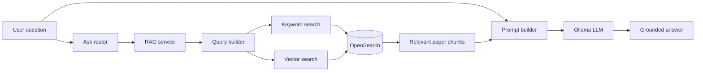

# RAG Query Flow

The later weeks add retrieval and generation on top of the ingestion
foundation.



## Two Halves of the Project

```text
Data engineering:
    collect -> parse -> store -> index

AI engineering:
    retrieve -> build context -> generate -> evaluate
```
