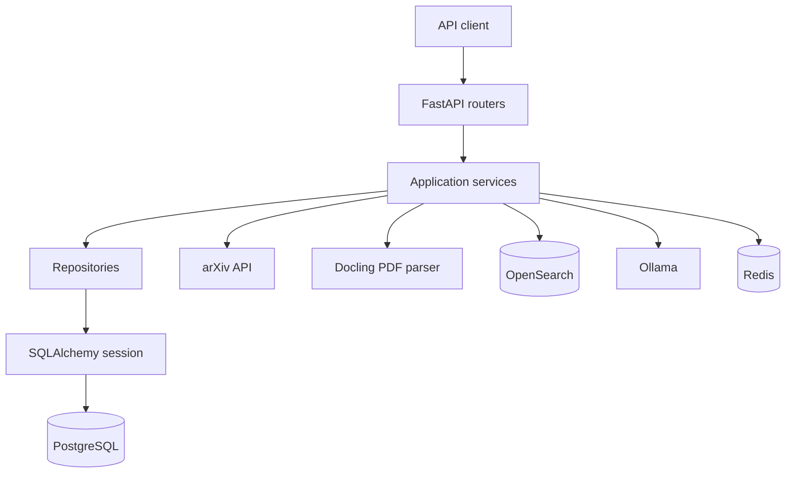

# System Architecture

This diagram shows the main layers and infrastructure used by the project.

## Responsibilities

- **Routers** receive HTTP requests and return validated responses.
- **Services** coordinate application workflows.
- **Repositories** contain database queries and persistence logic.
- **Models** describe database tables.
- **Schemas** describe validated input and output data.
- **Clients** isolate communication with external services.
