# Week 2 Ingestion Flow

The ingestion pipeline turns arXiv papers into searchable database data.

```mermaid
flowchart LR
    Runner[Weekly script or Airflow DAG] --> Fetcher[MetadataFetcher]
    Fetcher --> ArxivClient[ArxivClient]
    ArxivClient --> ArxivAPI[arXiv API]
    ArxivAPI --> Metadata[ArxivPaperMetadata]

    Metadata --> Download[Download PDF]
    Download --> Cache[(PDF cache)]
    Cache --> Parser[PDFParserService]
    Parser --> Docling[Docling]
    Docling --> Parsed[ParsedPdf]

    Metadata --> Create[PaperCreate]
    Parsed --> Create
    Create --> Repository[PaperRepository]
    Repository --> Database[(PostgreSQL papers table)]
```



## Data Transformation

```text
arXiv Atom XML
    -> ArxivPaperMetadata
    -> local PDF
    -> ParsedPdf
    -> PaperCreate
    -> PostgreSQL Paper row
```

`MetadataFetcher` orchestrates the workflow. `ArxivClient` talks to arXiv,
`PDFParserService` understands one PDF, and `PaperRepository` stores the
result.
